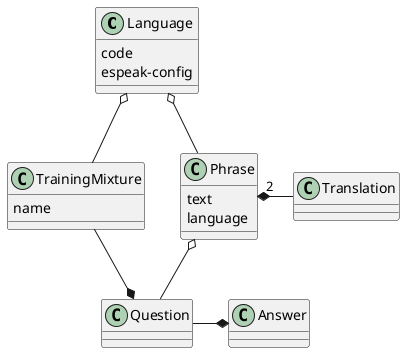
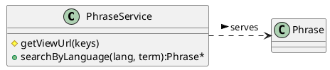
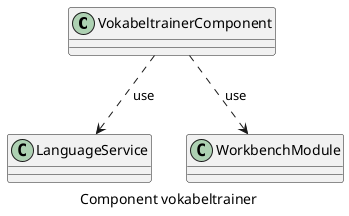
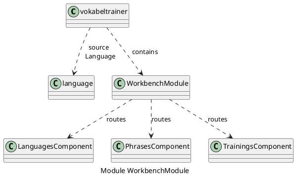

# CouchApp Angular Vokabeltrainer

However you have found my little project. I started it to lern Angular.
(And maybe later French with that.) 

Currently I did not get any Unit tests environment for angular to run.  

## Getting started:

### Install requirements:

```bash
sudo apt-get install couchdb couchapp
```

### Clone and build Project:

```bash
git clone https://github.com/MrDolch/couchapp-angular-Vokabeltrainer.git
cd couchapp-angular-Vokabeltrainer/vokabeltrainer
npm install
npm run build
```

### Install on couchdb

```bash
npm run deploy 
```
Maybe you like to choose another couchdb installation than on localhost,
then you need to edit `build.sh` in root folder before you run 
`npm run deploy`

### View app in Browser

```bash
firefox http://127.0.0.1:5984/vokabeltrainer/_design/couchapp/index.html
```

### Next steps

In the app you can add Languages, Phrases and create Training set-ups.
Soon you can start the training and whatch your wows.

- - -

## Personal Notes for Development









### Funktionalitäten

- Layout reparieren
- Übersichtsseite
- Plan und Vision
- jsdoc
- automatische Tests
+ plantuml

#### Sprachen erfassen

+ Language-Service bereitstellen
+ Sprachenverwaltung
+ Language-Component
+ Languages bei Phrasen anzeigen
- Einstellungen der Sprachen bearbeiten, z.B. Parameter für espeak

#### Vokabeln erfassen

+ Es können Vokabeln in einer Sprache eingegeben werden.
+ Die Sprache kann ausgewählt werden.
+ Zweite Sprache kann ausgewählt werden.
+ Übersetzung kann zugeordnet werden.
+ Component phrase-search umbenannt in translation-add
+ Bei Translation-add onClick herausholen
+ Extrahiere phrase-component
+ Lösche Translation, wenn Phrase gelöscht wird.
+ Layout Umstellung auf bootstrap

#### Trainieren

+ Trainingsseite
+ TrainingMixture Service und Component hinzufügen
+ Questions zu Mixture hinzufügen
+ Questions entfernen

#### Service

+ TextToSpeech
+ IPA
- Wav als _attachment ans EspeakSample anhängen
- Bilderdatenbank

#### Statistiken

#### Userverwaltung

#### Offline-Modus

### Hilfreiche Dokumentation

- [Vokabeltrainer-Couchapp](http://192.168.1.10:5984/vokabeltrainer/_design/couchapp/index.html)
- [TypeScript - Enums](https://www.typescriptlang.org/docs/handbook/enums.html)
- [List of Languages](https://en.wikipedia.org/wiki/List_of_ISO_639-1_codes)
- [Angular - @Input / @Output](https://angular.io/docs/ts/latest/cookbook/component-communication.html#!#parent-listens-for-child-event)
- [Inline Audio](https://stackoverflow.com/questions/17762763/play-wav-sound-file-encoded-in-base64-with-javascript)
- [bootstrap](http://getbootstrap.com/examples/theme/)

#### Couchdb

- [Python Couchdb](https://pythonhosted.org/CouchDB/client.html#database)
- [Python Couchdb start](https://pythonhosted.org/CouchDB/getting-started.html)
